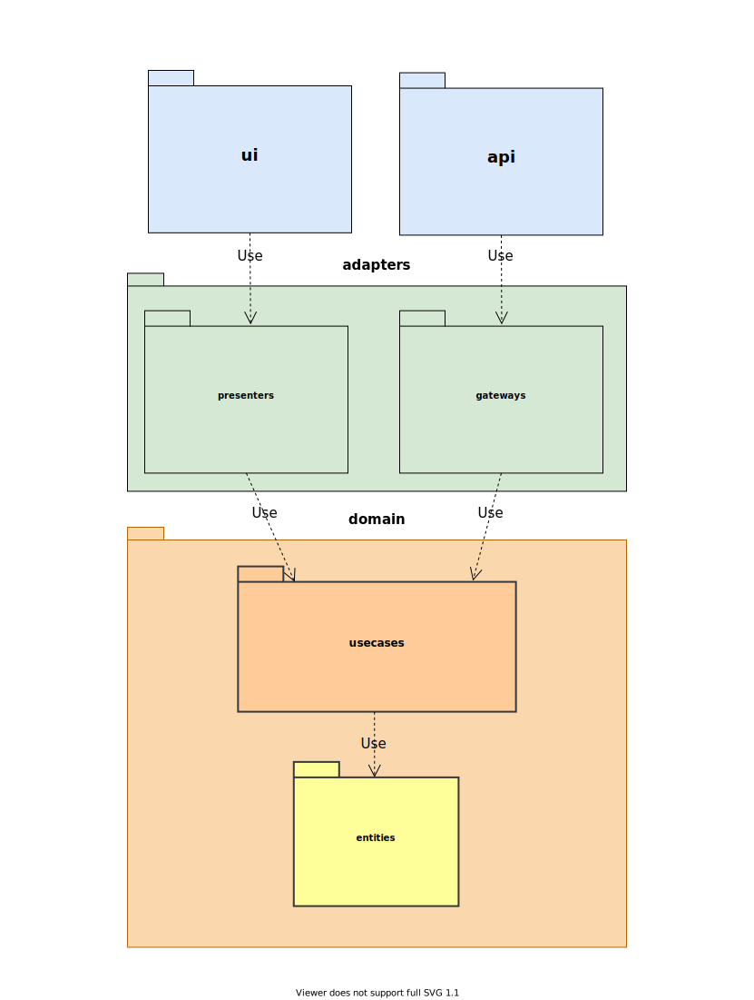

[SOFTSPIDERS](https://github.com/softspiders/softspiders)

## Fullstack counter-app starter on *React* in *TypeScript* that follows ***Clean Architecture*** principles

---
## Demo
Demo and server are both hosted on the *Codesandbox*.

In separate browser tabs do:
1. [Start server](https://xg4qv.sse.codesandbox.io)
2. [Start demo](https://pzpw2.csb.app/)

---

## Feature tags
- clean-architecture
- counter-app
- db
- fullstack
- jest
- jest-fetch-mock
- json-server
- react
- react-hooks
- react-testing-library
- rest
- starter
- test-coverage
- typescript
- unit-test

---
## Author

[Alexander Lapygin](https://github.com/AlexanderLapygin) <<alexanderlapygin@gmail.com>>

---

<p align="center">
  <a href="https://github.com/softspider">
    
  </a>
  </br>
  <b>Package structure</b>
</p>

---

## Running locally

See [that repository](https://github.com/softspiders/clean-architecture-counter-starters/tree/clean-architecture-counter-react-hooks-fullstack-jest-ts-starter)

## Run tests

```sh
npm run test
```

test with coverage:
```sh
npm run test:coverage
```

---

## License

Licensed under the [MIT license](./LICENSE).
