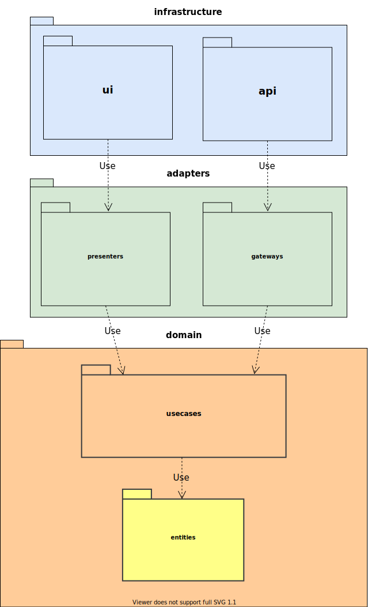

<div align="center">
    <a href="https://github.com/softspiders/softspiders">
      
    </a>
</div>

## Client application starter on the Clean Architecture

It is the client part of the [Fullstack counter-app starter on React in TypeScript that follows Clean Architecture principles](https://github.com/softspiders/clean-architecture-counter-starters/tree/clean-architecture-counter-react-hooks-fullstack-jest-ts-starter).

---

## Presentation

[Starter for Clean Architecture](https://ca-react-rest-api-starter.vercel.app/)

---

## Feature tags
- clean-architecture
- client
- counter-app
- dip
- jest
- jest-fetch-mock
- mdx-deck
- react
- react-hooks
- react-testing-library
- rest
- srp
- ss-deck
- starter
- test-coverage
- typescript
- unit-test
- use-presenter

---

## Parents

- [**- db, fullstack, jest, jest-fetch-mock, json-server, react, react-hooks, react-testing-library, rest**](https://github.com/softspiders/dip-in-ca)
- [**- counter-app, dip, jest, jest-fetch-mock, react, react-hooks, react-testing-library, srp, starter, test-coverage, typescript, unit-test, use-presenter**](https://github.com/softspiders/ca-on-frontend)

## Children

- [**+ monorepo**](https://github.com/softspiders/ca-react-rest-monorepo)

---

## Demo
Demo and server are both hosted on the *Codesandbox*.

In separate browser tabs do:
1. [Start server](https://xg4qv.sse.codesandbox.io)
2. [Start demo](https://pzpw2.csb.app/)

---
## Author

[Alexander Lapygin](https://github.com/AlexanderLapygin) <<alexanderlapygin@gmail.com>>

---
## Inspired by

[Eduardo Moroni](https://github.com/eduardomoroni)'s
[*react-clean-architecture*](https://github.com/eduardomoroni/react-clean-architecture)

---

<p align="center">
  <a href="https://github.com/softspider">
    
  </a>
  </br>
  <b>Package structure</b>
</p>

---

## Running locally

See [that repository](https://github.com/softspiders/clean-architecture-counter-starters/tree/clean-architecture-counter-react-hooks-fullstack-jest-ts-starter)

## Run tests

```sh
npm run test
```

test with coverage:
```sh
npm run test:coverage
```

---

## License

Licensed under the [MIT license](./LICENSE).

<div align="center">
    <a href="https://github.com/softspiders/softspiders">SOFTSPIDERS</a>
</div>
